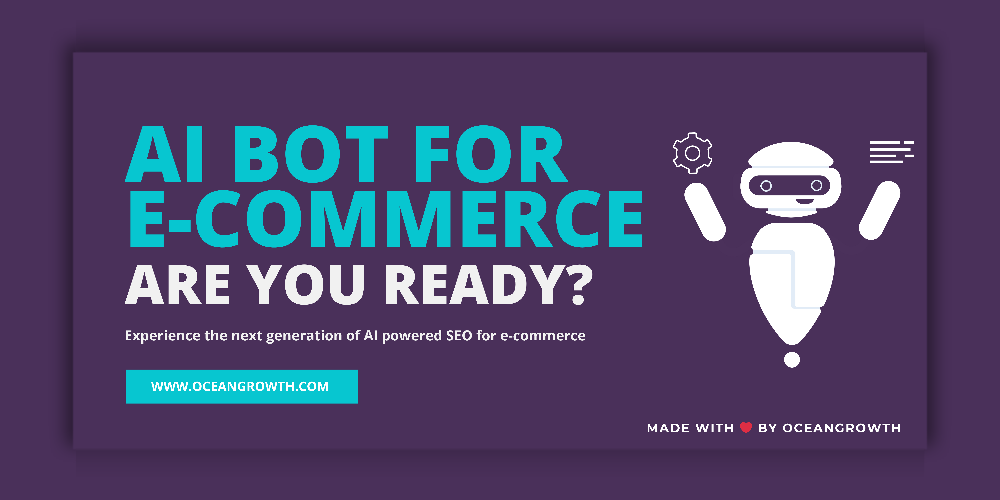

# ai-bot-commerce-seo

1. run 'npm i'
2. Add your OPENAI_API_KEY in the env file
3. replace the product.csv with your file in the same format
4. run 'node ai-bot.js'
5. checkout the word document generated in the output folder
